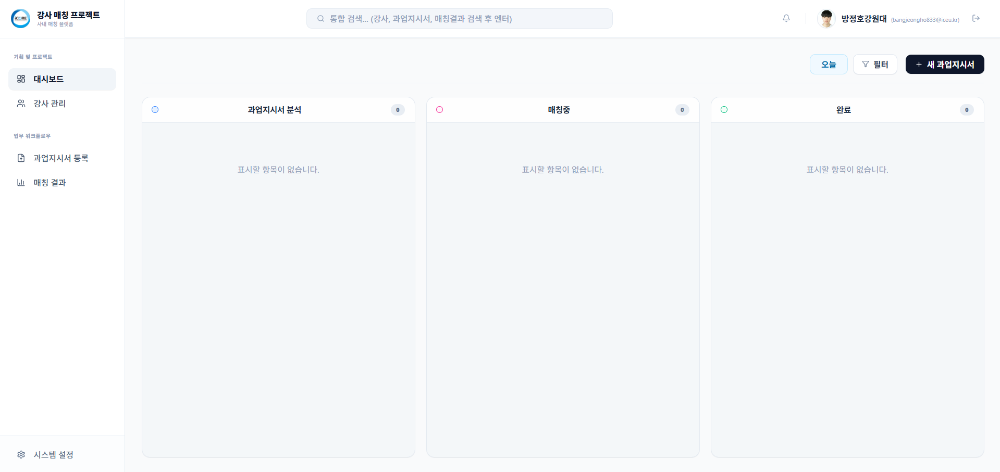
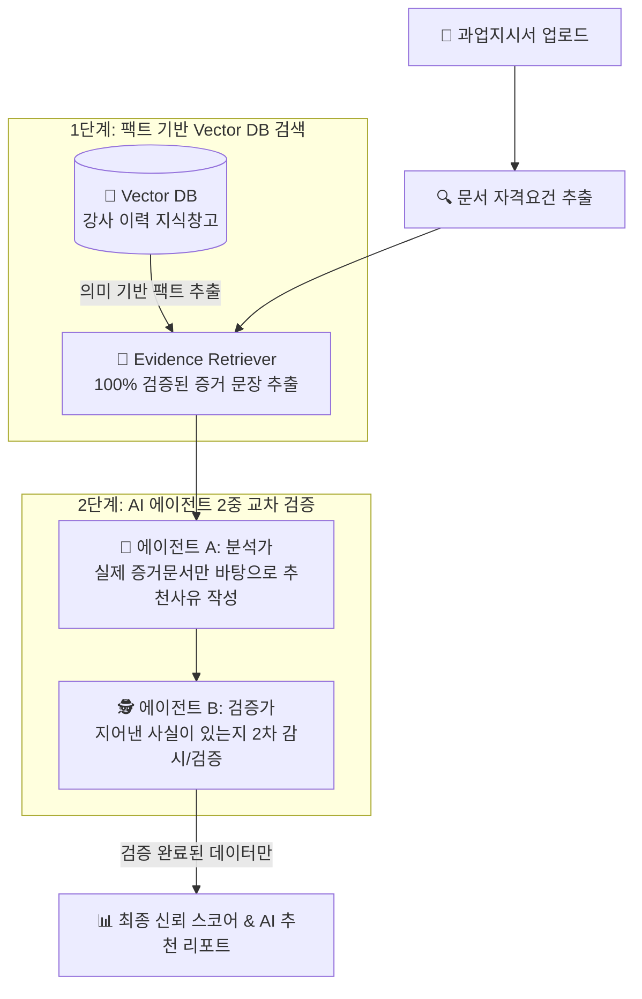
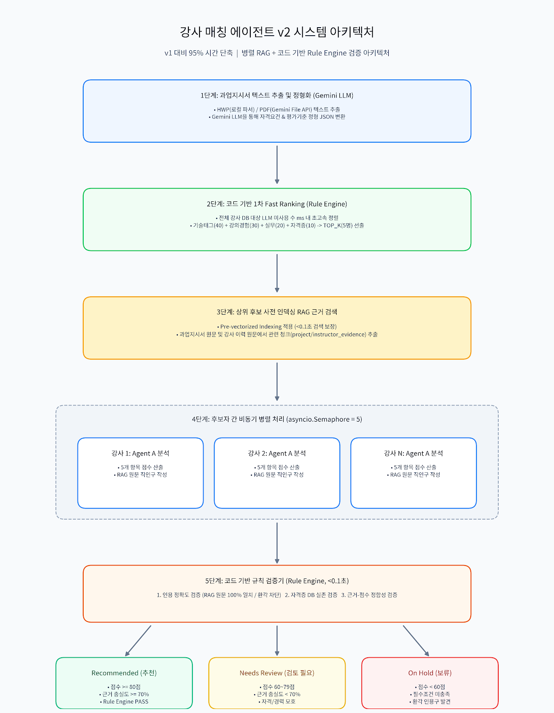
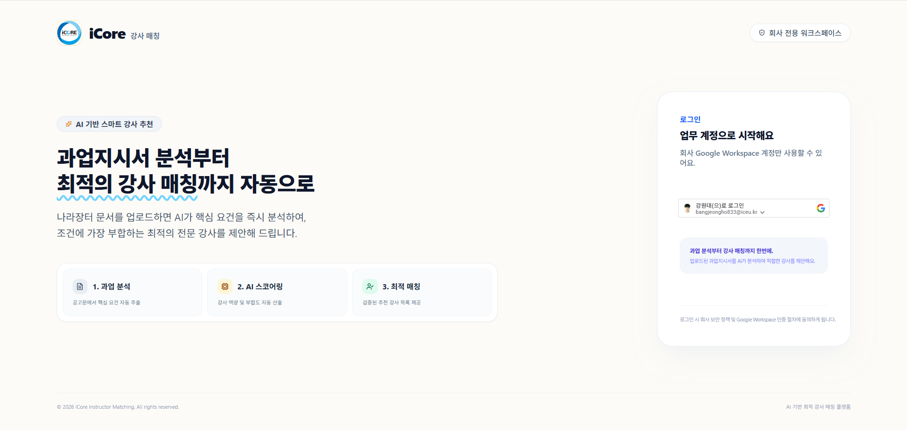
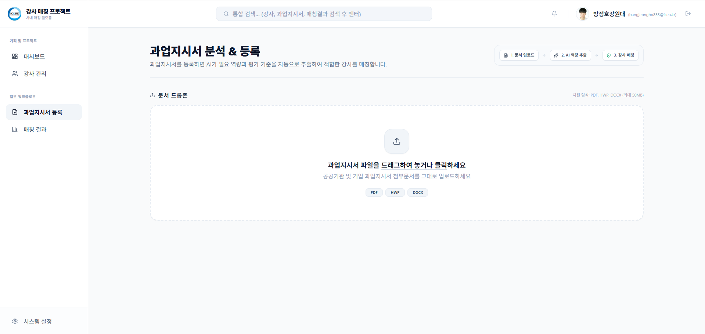
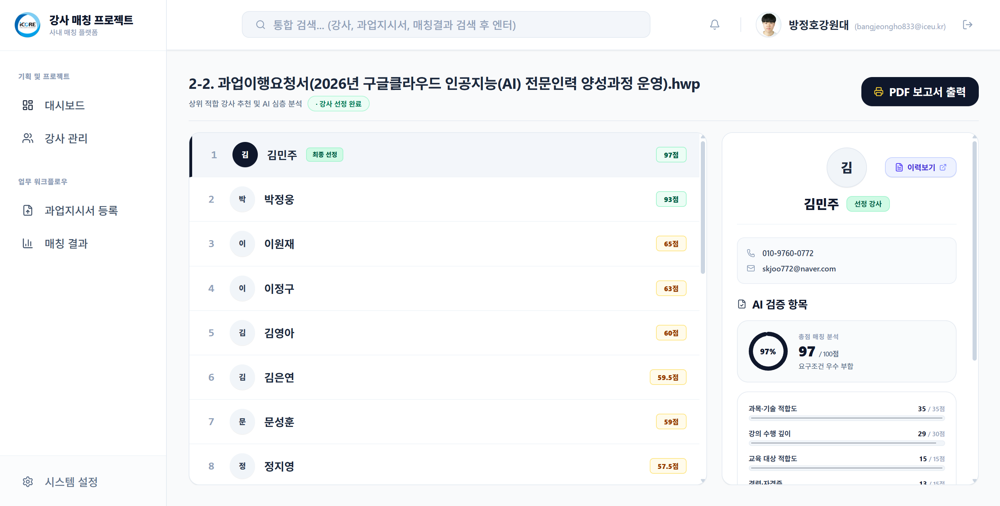
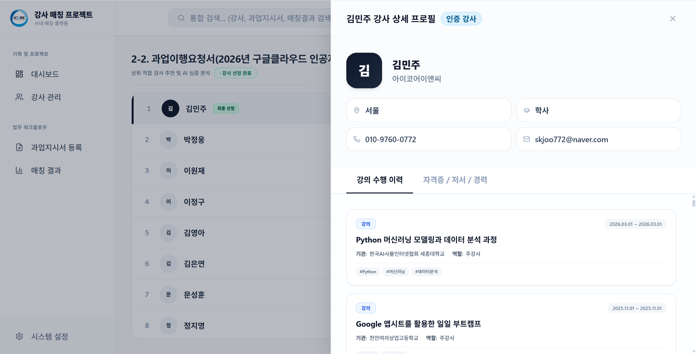

# 🎓 i-Core AI 강사 매칭 & 과업 분석 플랫폼

> **공고문 문서(HWP/PDF)만 올리면 AI가 핵심 요건을 읽고, 가장 적합한 전문 강사를 자동으로 추천해주는 스마트 매칭 서비스**

<p align="left">
  <a href="https://i-core-frontend-761086712825.asia-northeast3.run.app">
    
  </a>
  <a href="https://i-core-backend-761086712825.asia-northeast3.run.app/docs">
    
  </a>
  <a href="https://github.com/BANG-JEONGHO/i-core/actions">
    
  </a>
</p>

---

## 🛠️ 기술 스택 (Tech Stack)

### 🎨 Frontend
<p>
  
  
  
  
  
  
  
</p>

### ⚙️ Backend & AI Core
<p>
  
  
  
  
  
  
  
</p>

### ☁️ Cloud Infrastructure & DevOps
<p>
  
  
  
  
  
</p>

---

## 📌 서비스 한눈에 보기 (Service Overview)

💡 **"수십 페이지 공고 문서, 매번 읽고 강사 찾기 힘들지 않으셨나요?"**

**i-Core**는 공공기관(나라장터 등)이나 기업에서 발주하는 수십~수백 페이지짜리 사업 공고문(과업지시서)을 사람이 일일이 다 읽을 필요 없이, **AI가 문서를 분석하여 필요한 조건에 딱 맞는 최고의 강사를 순식간에 찾아주는 서비스**입니다.

### ❓ 무엇이 좋아지나요?
- ⏱️ **업무 시간 90% 단축**: 몇 시간씩 걸리던 서류 검토 및 강사 수소문 과정을 단 **수초~수분**으로 줄여줍니다.
- 🎯 **정확한 맞춤 추천**: 필수 자격증, 강의 경력 연수, 교육 분야를 종합 판단하여 가장 적합한 강사를 순위별로 보여줍니다.
- 📅 **실제 일정 충돌 방지**: 추천받은 강사가 해당 날짜에 이미 다른 강의가 있는지 미리 확인하여 섭외 실패를 예방합니다.

<!-- 🖼️ [이미지 슬롯 1] 메인 대시보드 화면 -->
<p align="center">
  
  <br>
  <em>▲ i-Core 한눈에 보는 메인 대시보드 화면</em>
</p>

---

## 🛡️ AI 할루시네이션(거짓말) 방지 아키텍처

> *"AI가 존재하지 않는 이력이나 자격증을 맘대로 지어내서 추천하면 어쩌죠?"*

i-Core는 AI의 가장 큰 단점인 **할루시네이션(거짓 정보 생성)**을 철저히 막기 위해 **3단계 사실 검증 시스템(Vector DB + RAG + 교차 검증 에이전트)**을 구축했습니다.



<!-- 🖼️ [이미지 슬롯 6] AI 에이전트 교차 검증 구조 다이어그램 -->
<p align="center">
  
  <br>
  <em>▲ Vector DB 기반 사실 추출 및 2단계 AI 에이전트 교차 검증 메커니즘</em>
</p>

### 📐 3단계 할루시네이션 방지 원리

1. **💾 1단계: Vector DB (팩트 전용 지식창고)**
   - 강사들의 모든 실제 이력서, 보유 자격증, 강의 경력을 AI가 이해할 수 있는 의미 단위(Vector)로 변환해 저장합니다.
   - 외부의 인터넷 정보나 추측을 배제하고 **오직 검증된 내부 데이터**만 참조합니다.

2. **📑 2단계: Evidence Retriever (증거 수집기)**
   - AI가 답변을 작성하기 전, 공고문 조건과 강사 데이터에서 **"100% 사실로 확인된 증거 문장(Evidence)"만 선별**해 냅니다.
   - 근거가 없는 정보는 아예 AI에게 전달하지 않음으로써 거짓말의 원인을 차단합니다.

3. **🕵️ 3단계: 2-Step 에이전트 교차 검증 (Analyst & Verifier)**
   - **분석가 AI(Match Analyst)**: 수집된 실제 증거 문장만 보고 1차 추천 사유를 작성합니다.
   - **검증가 AI(Match Verifier)**: 분석가 AI가 쓴 글 중 조금이라도 부풀려지거나 문서에 없는 표현이 있는지 **독립된 검증 AI가 2차 감시 및 검수**를 진행합니다.

---

## ✨ 쉽게 알아보는 4가지 핵심 기능 (Key Features)

### 1. 🔒 편리한 구글 간편 로그인
- **원클릭 접속**: 매번 아이디/비밀번호를 입력할 필요 없이 사내 Google 계정으로 1초 만에 로그인합니다.
- **안전한 보안**: 로그인 정보는 안전하게 보호되며 관리자 승인 기반으로 작동합니다.

<!-- 🖼️ [이미지 슬롯 2] 로그인 화면 -->
<p align="center">
  
  <br>
  <em>▲ 구글 계정으로 시작하는 원클릭 로그인 화면</em>
</p>

---

### 2. 📄 문서 파일만 올리면 끝! (자동 서류 분석)
- **한글(HWP), PDF, Word 파일 모두 지원**: 공고 첨부파일을 그대로 올리기만 하면 됩니다.
- **핵심 정보만 쏙쏙 요약**: 공고문 속의 **필요 자격증, 요구 경력 연수, 교육 과목, 강의 일정**을 AI가 자동으로 핵심만 뽑아서 정리해 줍니다.

<!-- 🖼️ [이미지 슬롯 3] 과업지시서 업로드 및 분석 화면 -->
<p align="center">
  
  <br>
  <em>▲ 공고문 파일 업로드 시 AI가 핵심 항목을 자동 정리해주는 화면</em>
</p>

---

### 3. 🎯 AI가 알려주는 "이 강사님을 추천하는 이유"
- **점수 기반 순위 추천**: 자격증, 경력, 전문 분야를 종합하여 가장 적합한 강사 순위를 보여줍니다.
- **친절한 AI 종합 리포트**: "왜 이 강사님이 1위로 추천되었는지" 강점과 세부 추천 사유를 구체적인 글 형태로 안내해 줍니다.

<!-- 🖼️ [이미지 슬롯 4] 매칭 결과 및 AI 추천 리포트 화면 -->
<p align="center">
  
  <br>
  <em>▲ 추천 강사 순위표 및 AI가 써준 상세 추천 이유 리포트 화면</em>
</p>

---

### 4. 📊 강사 정보 및 일정 한눈에 관리
- **강사 통합 프로필 조회**: 보유 강사들의 강의 이력, 자격증, 연락처를 편리하게 검색할 수 있습니다.
- **일정 자동 확인**: 특정 날짜에 강사님이 이미 다른 교육 스케줄이 있는지 사전에 알려주어 일정 중복을 방지합니다.

<!-- 🖼️ [이미지 슬롯 5] 강사 프로필 및 일정 관리 화면 -->
<p align="center">
  
  <br>
  <em>▲ 강사 프로필 상세 조회 및 강의 스케줄 관리 화면</em>
</p>

---

## 🏗️ 시스템 구성 (Unified Architecture)

```text
i-core/
├── .github/workflows/             # 깃허브 push 시 구글 클라우드 자동 배포 파일
│
├── backend/                       # 백엔드 서버 (AI 문서 분석 & 매칭 알고리즘 실행 엔진)
│   ├── app/                       # 로그인, 강사 데이터, 매칭 서비스 연결 통로
│   ├── agent_core/                # Gemini AI 기반 심층 평가 & Vector DB 할루시네이션 검증 엔진
│   │   ├── services/vector_store.py       # Vector DB (의미 기반 지식 창고)
│   │   ├── services/evidence_retriever.py # 팩트 증거 추출기
│   │   └── services/evidence_validator.py # AI 교차 검증 및 할루시네이션 방지 모듈
│   ├── matching_core/             # 문서 파서(HWP/PDF/DOCX) 및 조건 스코어 계산기
│   └── data/                      # 데이터베이스 저장소
│
├── frontend/                      # 프론트엔드 (사용자가 보는 예쁜 웹 화면)
│   ├── src/pages/                 # 로그인, 대시보드, 분석 업로드, 매칭 결과 화면들
│   └── src/components/            # 상단 메뉴바, 버튼, 상세 팝업창 공통 부품
│
├── docs/images/                   # README에 들어갈 캡처 이미지 저장 폴더
├── start.bat                      # 내 컴퓨터에서 로컬로 테스트할 때 누르는 실행 파일
└── README.md                      # 프로젝트 소개 문서
```

---

## ⚡ 빠른 시작 가이드 (Quick Start)

### 1. 웹사이트에서 바로 사용하기 (인터넷만 있으면 접속 가능)
구글 클라우드에 배포되어 있어 프로그램 설치 없이 브라우저로 바로 접속할 수 있습니다:
- **웹 서비스 접속**: [https://i-core-frontend-761086712825.asia-northeast3.run.app](https://i-core-frontend-761086712825.asia-northeast3.run.app)
- **개발자 API 문서**: [https://i-core-backend-761086712825.asia-northeast3.run.app/docs](https://i-core-backend-761086712825.asia-northeast3.run.app/docs)

---

### 2. 내 컴퓨터에서 직접 테스트할 때 (개발자용)
프로젝트 폴더에서 `start.bat`을 실행하면 내 컴퓨터에서 바로 테스트 환경이 켜집니다:
```powershell
.\start.bat
```
- 접속 주소: `http://localhost:8900`
