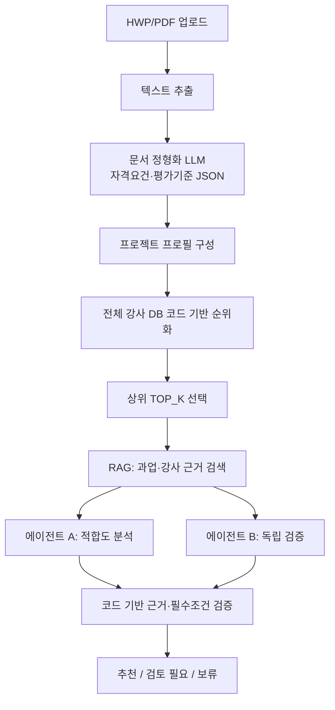

# 강사 매칭 에이전트 구조 및 프롬프트 규칙

## 1. 개요

현재 강사 매칭은 다음으로 구성된다.

- 문서 정형화 LLM: 과업지시서에서 자격요건과 평가기준을 JSON으로 추출
- 코드 기반 후보 순위화: 강사 DB 전체를 빠르게 점수화
- RAG 근거 검색: 과업지시서와 강사 이력의 관련 원문 근거 검색
- 에이전트 A: 강사 적합도 분석
- 에이전트 B: A의 결과를 보지 않는 독립 검증
- 코드 기반 근거·필수조건 검증 및 최종 정책 병합



## 2. 단계별 처리 순서

### 2.1 과업지시서 텍스트 추출 및 정형화

HWP는 로컬 HWP 5.x 파서로 본문을 추출하고, PDF는 Gemini File API로 처리한다. 추출된 텍스트는 Gemini에 전달되어 다음 JSON으로 정형화된다.

```json
{
  "qualifications": [
    {
      "category": "자격증",
      "description": "정보처리기사 이상",
      "is_mandatory": true,
      "keywords": ["정보처리기사"]
    }
  ],
  "evaluation_criteria": [
    {
      "category": "기술평가",
      "description": "유사 사업 수행 실적",
      "weight": 60,
      "keywords": ["유사사업", "실적"]
    }
  ]
}
```

### 2.2 전체 강사 후보 순위화

LLM을 호출하지 않고 강사 DB 전체를 빠르게 순위화한다. 이 단계는 최종 추천 점수가 아니라, 검토 후보를 고르기 위한 검색 점수다. 0점 강사도 삭제하지 않고 결과에 유지한다.

| 항목 | 최대 점수 |
| --- | ---: |
| 기술·주제 태그 일치 | 40점 |
| 강의 경험 | 30점 |
| 프로젝트·실무 경험 | 20점 |
| 필수 자격증 | 10점 |

### 2.3 상위 후보 RAG 근거 검색

환경변수 `AGENT_REVIEW_TOP_K`의 수만큼 상위 후보를 선택한다. 각 후보에 대해 과업지시서 원문과 강사 이력의 관련 청크를 검색한다.

- 과업 원문은 벡터 저장소에 색인한다.
- 강사 원본 이력이 색인되어 있지 않으면 DB 프로필을 텍스트로 변환해 색인한다.
- 에이전트는 검색된 `project_evidence`와 `instructor_evidence`만 인용할 수 있다.

### 2.4 에이전트 A → 에이전트 B → 코드 검증

에이전트 A와 B는 같은 과업·강사·RAG 근거를 받는다. 단, B는 A의 분석 결과를 받지 않아 독립 검증을 수행한다. 두 결과 뒤에는 코드가 인용문과 필수조건을 재검증한다.

## 3. 프롬프트 및 에이전트 규칙

### 3.1 문서 정형화 LLM

**역할**: 나라장터 과업지시서 분석 전문가

**규칙**:

1. 신청/참여 자격에서 학력, 경력, 자격증, 인력 요건을 추출한다.
2. 평가기준에서 기술·가격·실적 평가와 배점을 추출한다.
3. 각 항목의 핵심 키워드를 추출한다.
4. 필수와 우대 조건을 구분한다.
5. 설명 없이 정해진 JSON만 출력한다.

### 3.2 에이전트 A: 적합도 분석

**역할**: 과업 조건과 강사 프로필을 비교해 점수와 추천 근거를 작성한다.

| 평가 항목 | 최대 점수 |
| --- | ---: |
| `topic_match` | 35점 |
| `teaching_depth` | 30점 |
| `audience_fit` | 15점 |
| `career_and_certification` | 15점 |
| `evidence_completeness` | 5점 |

**규칙**:

1. `RETRIEVED_EVIDENCE` 안의 과업·강사 근거만 인용한다.
2. 인용문의 문서 ID, 섹션, 문구를 원문 그대로 복사한다. 새 인용문이나 출처를 만들지 않는다.
3. 근거 충실도를 제외한 양수 점수에는 과업 근거와 강사 근거가 각각 하나 이상 있어야 한다. 한쪽이 없으면 0점이다.
4. 원문에 없는 자격증, 경력, 교육 시간, 프로젝트 경험을 사실처럼 작성하지 않는다.
5. 필수 조건 미충족이 명확하면 `required_conditions_passed`를 `false`로 한다.
6. 충족 여부를 확인할 수 없으면 `null`로 두고 `gaps`에 기록한다.
7. 항목 점수 합계는 `total_score`와 일치해야 한다.
8. 정의된 스키마 JSON만 출력한다.

### 3.3 에이전트 B: 독립 검증

**역할**: A의 결과를 보지 않고, 과업·강사·검색 근거만으로 독립 점수와 판정을 작성한다.

**점수 체계**: A와 동일하다.

**규칙**:

1. 검색된 원문 근거만 사용하고, 출처와 인용문을 그대로 복사한다.
2. 양수 점수에는 과업·강사 양쪽 근거가 필요하다. 부족하면 점수를 낮추거나 0점으로 한다.
3. 필수 자격증, 벤더 자격증, 경력 조건이 명확히 충족되지 않으면 `issues`에 기록한다.
4. 명확한 필수조건 미충족 또는 핵심 근거 부재는 `FAIL`이다.
5. 정보 부족, 조건 해석 필요, 경미한 조정은 `REVIEW`이다.
6. 충분한 근거와 조건 충족이 확인되면 `PASS`이다.
7. `evidence_coverage`는 양수 점수 주장 중 양쪽 근거가 있는 비율이다.
8. 정의된 스키마 JSON만 출력한다.

### 3.4 ProjectAnalyzerAgent

이 에이전트의 프롬프트는 존재하지만 현재 웹 매칭 흐름에서는 호출하지 않는다. 현재는 문서 정형화 결과를 백엔드가 직접 `ProjectProfile`로 변환한다.

향후 활성화할 경우의 역할은 다음과 같다.

- 원문에 명시된 사실만으로 `ProjectProfile` JSON 작성
- 원문에 없는 정보는 `null` 또는 빈 배열 사용
- 교육 주제, 대상, 기술 분야, 강사 자격, 산출물, 운영 조건을 필드별로 분리
- 근거는 원문에 실제로 존재하는 연속 문구만 사용
- 스키마 JSON 외 설명 금지

## 4. 코드 기반 검증

LLM 응답 뒤에 다음을 기계적으로 확인한다.

1. A와 B가 인용한 문구가 실제 RAG 검색 결과에 존재하는지
2. 필수 자격증과 벤더 자격증이 강사 DB에 정확히 존재하는지
3. 근거 없이 양수 점수를 부여한 항목이 있는지

경력 요건은 숫자 규칙으로 구조화되지 않은 경우 자동 판정하지 않고 `not_automatically_verifiable`로 남긴다.

## 5. 최종 병합 정책

최종 점수는 A와 B의 점수 평균이다.

| 조건 | 최종 상태 |
| --- | --- |
| 코드 검증 `FAIL` | `on_hold` |
| A 또는 B가 필수조건 미충족 판정 | `on_hold` |
| B가 `FAIL` | `on_hold` |
| A/B 점수 차이 15점 초과 | `on_hold` |
| 근거 충실도 70% 미만 | `on_hold` |
| 코드 검증 `REVIEW` 또는 B가 `REVIEW` | `needs_review` |
| A/B 점수 차이 6점 이상 | `needs_review` |
| 근거 충실도 70% 이상 90% 미만 | `needs_review` |
| 위 조건이 모두 없고 근거가 충분함 | `recommended` |

## 6. 실행 시간 관련 참고

상위 후보 한 명의 정밀 검토에는 A와 B의 독립 LLM 호출이 각각 포함된다. 따라서 `AGENT_REVIEW_TOP_K`가 커질수록 시간이 거의 선형으로 증가한다.

- 기본 추천: 코드 기반 전체 순위 + 소수 후보 검토
- 정밀 검증: 최종 후보에만 A/B와 근거 검증 수행

현재 설정값은 백엔드 `.env`의 `AGENT_REVIEW_TOP_K`에서 관리한다.

## 7. 관련 코드

- 문서 정형화: `instructor-matching-backend/app/services/ai_agent.py`
- 웹 연동 어댑터: `instructor-matching-backend/app/services/agent_core_adapter.py`
- 배치 매칭: `agent_core/services/batch_matching.py`
- 후보 순위화: `agent_core/services/candidate_ranker.py`
- RAG: `agent_core/services/evidence_retriever.py`
- A/B 에이전트: `agent_core/services/agents.py`
- 최종 병합: `agent_core/services/matching.py`
- 코드 검증: `agent_core/services/evidence_validator.py`
- 프롬프트: `agent_core/prompts/`
