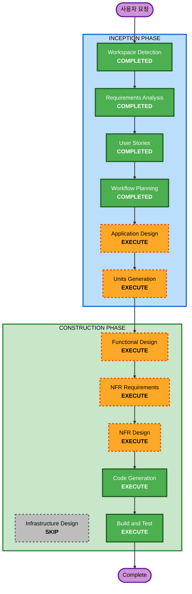

# 실행 계획 (Execution Plan)

## 상세 분석 요약

### 변경 영향 평가
- **사용자 영향**: Yes — 회사 전체 직원이 사용하는 새 업무 도구
- **구조적 변경**: Yes — 신규 시스템 설계 (프론트엔드 + 백엔드 + AI 엔진)
- **데이터 모델 변경**: Yes — 강사, 과업지시서, 매칭결과 테이블 신규 생성
- **API 변경**: Yes — REST API 전체 신규 설계
- **NFR 영향**: Yes — 보안(Security Baseline), 성능(매칭 응답 시간), 확장성

### 위험 평가
- **위험 수준**: Medium
- **근거**: 신규 프로젝트라 기존 시스템 영향 없음. 단, 문서 파싱(HWP/PDF)과 AI 매칭은 기술적 복잡도가 있음
- **롤백 복잡도**: Easy (신규 프로젝트)
- **테스트 복잡도**: Moderate (문서 파싱 정확도 검증, 매칭 품질 검증 필요)

---

## 워크플로우 시각화



### 텍스트 대안 (Text Alternative)
```
INCEPTION PHASE:
  [COMPLETED] Workspace Detection
  [COMPLETED] Requirements Analysis
  [COMPLETED] User Stories
  [COMPLETED] Workflow Planning
  [EXECUTE]   Application Design
  [EXECUTE]   Units Generation

CONSTRUCTION PHASE:
  [EXECUTE]   Functional Design (per-unit)
  [EXECUTE]   NFR Requirements (per-unit)
  [EXECUTE]   NFR Design (per-unit)
  [SKIP]      Infrastructure Design
  [EXECUTE]   Code Generation (per-unit)
  [EXECUTE]   Build and Test
```

---

## 실행 단계 상세

### INCEPTION PHASE
- [x] Workspace Detection (COMPLETED)
- [x] Requirements Analysis (COMPLETED)
- [x] User Stories (COMPLETED)
- [x] Workflow Planning (COMPLETED)
- [ ] Application Design - **EXECUTE**
  - **근거**: 신규 시스템으로 컴포넌트 설계, 서비스 레이어, API 구조 정의 필요
- [ ] Units Generation - **EXECUTE**
  - **근거**: 3단계 매칭 엔진 + 프론트엔드 + 백엔드로 복수 유닛 분리 필요

### CONSTRUCTION PHASE
- [ ] Functional Design - **EXECUTE** (per-unit)
  - **근거**: 매칭 알고리즘 비즈니스 로직, 파싱 로직, 데이터 모델 상세 설계 필요
- [ ] NFR Requirements - **EXECUTE** (per-unit)
  - **근거**: Security Baseline 적용 필수, 성능 요구사항 존재
- [ ] NFR Design - **EXECUTE** (per-unit)
  - **근거**: 보안 패턴, 로깅, 인증 설계 필요
- [ ] Infrastructure Design - **SKIP**
  - **근거**: 배포 환경 미정, 현재는 로컬 개발 환경에서 동작하면 충분
- [ ] Code Generation - **EXECUTE** (per-unit, ALWAYS)
  - **근거**: 실제 코드 구현 필요
- [ ] Build and Test - **EXECUTE** (ALWAYS)
  - **근거**: 빌드 및 테스트 검증 필요

### OPERATIONS PHASE
- [ ] Operations - **PLACEHOLDER**
  - **근거**: 배포 환경 결정 후 추가

---

## 성공 기준
- **주요 목표**: 과업지시서 업로드 → 파싱 → 강사 매칭이 동작하는 1단계 MVP 완성
- **핵심 산출물**:
  - FastAPI 백엔드 (인증, 강사 CRUD, 파싱, 매칭 API)
  - React/TS 프론트엔드 (업로드, 결과 표시, 대시보드)
  - 1단계 매칭 엔진 (키워드 + 규칙 기반)
- **품질 기준**:
  - Security Baseline 규칙 준수
  - 매칭 응답 시간 5초 이내
  - 한글 인터페이스 제공
