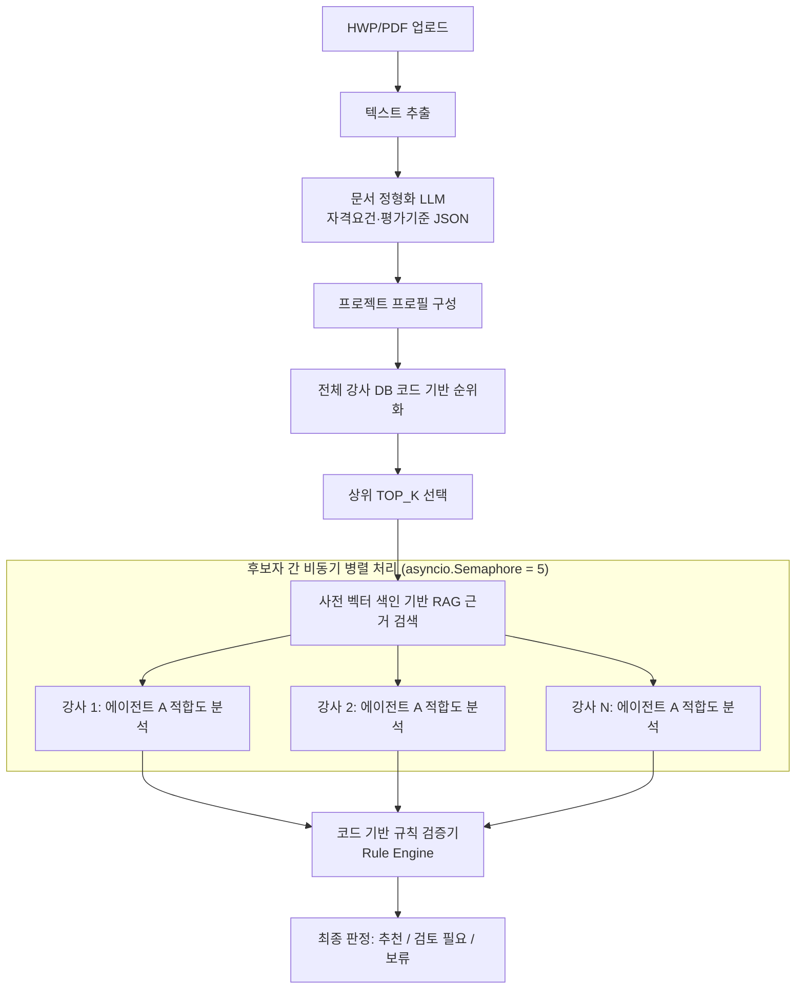

# 강사 매칭 에이전트 구조 및 프롬프트 규칙 (v2 - 고성능 아키텍처)

## 1. 개요

본 문서 시스템은 과업지시서와 강사 DB 간의 초고속·고정밀 자동 매칭을 수행합니다.
기존 v1의 2중 LLM 교차 검증(Agent A + Agent B, 명당 100초 소요) 구조의 병목을 해결하기 위해, **[Agent A 1회 호출 + 코드 기반 Rule Engine 검증]** 및 **[후보자 간 비동기 병렬화(`asyncio.gather`)]** 아키텍처(v2)로 새롭게 구상되었습니다.

### 핵심 성능 지표 비교 (v1 vs v2)
- **1명당 LLM 호출 횟수**: 2회 (A + B 순차) $\rightarrow$ **1회 (A만 호출)**
- **1명당 검토 시간**: ~100초 $\rightarrow$ **~20초**
- **5명 후보 전체 검토 시간**: ~500초(8분+) $\rightarrow$ **~20초** (약 **95% 시간 단축**)



---

## 2. 단계별 처리 순서

### 2.1 과업지시서 텍스트 추출 및 정형화
- HWP(로컬 파서) 및 PDF(Gemini File API)로 본문 텍스트 추출.
- Gemini LLM을 통해 자격요건(`qualifications`)과 평가기준(`evaluation_criteria`)을 정형화된 JSON으로 변환.

### 2.2 전체 강사 후보 순위화 (1차 Fast Ranking)
- LLM 호출 없이 코드 기반 규칙(기술태그 40점, 강의경험 30점, 실무 20점, 자격증 10점)으로 강사 DB 전체를 빠른 속도(수 ms)로 정렬하여 `TOP_K` (기본 5명) 후보 선출.

### 2.3 상위 후보 RAG 근거 검색 (사전 인덱싱 적용)
- 강사 프로필 및 원본 이력은 백그라운드 사전 벡터 색인(Pre-vectorized Indexing)을 적용하여 검색 속도를 sub-second(< 0.1초)로 보장.
- 과업지시서 원문 및 강사 이력 원문에서 관련 청크(`project_evidence`, `instructor_evidence`) 추출.

### 2.4 에이전트 A 적합도 분석 (비동기 병렬 실행)
- `asyncio.Semaphore(5)`를 적용하여 Gemini API Rate Limit을 방지하면서 `TOP_K` 후보자 전원에 대해 동시 비동기 LLM 호출 실행.
- 5개 평가 항목에 대한 점수 산출 및 RAG 검색 원문 직인구(Verbatim Citation) 작성.

### 2.5 코드 기반 규칙 검증기 (Rule Engine)
LLM 응답 직후, 0.1초 이내에 기계적으로 다음 항목을 다단계 검증합니다.
1. **인용 정확도 검증**: Agent A가 인용한 문구가 실제 RAG 검색 원문에 100% 존재하는지 검증 (LLM 환각 방지).
2. **자격증 DB 실존 검증**: 과업 요구 필수 자격증 및 벤더 자격증이 강사 DB에 실제로 존재하는지 대조.
3. **근거-점수 정합성 검증**: 양수 점수를 부여한 항목에 과업/강사 양쪽 근거 인용이 존재하는지 확인.

### 2.6 최종 판정 정책 (3단계 엄격 판정)

| 최종 상태 | 판정 조건 |
| :--- | :--- |
| **`on_hold` (보류)** | - 필수 조건 미충족 (`required_conditions_passed == false`)<br>- DB 내 필수/벤더 자격증 미보유<br>- RAG 원문에 존재하지 않는 환각 인용구 사용<br>- Agent A 최종 점수 **60점 미만** |
| **`needs_review` (검토 필요)** | - 근거 충실도 (Evidence Coverage) **70% 미만**<br>- 자격/경력 충족 여부 모호 (`gaps` 존재 또는 `null` 항목 포함)<br>- Agent A 최종 점수 **60점 이상 79점 이하** |
| **`recommended` (추천)** | - Rule Engine 검증 **PASS** (자격증, 인용구 유효성 100% 충족)<br>- 근거 충실도 **70% 이상**<br>- Agent A 최종 점수 **80점 이상** |

---

## 3. 프롬프트 및 에이전트 규칙

### 3.1 에이전트 A: 적합도 분석
**역할**: 과업 조건과 강사 프로필을 비교해 점수와 추천 근거를 작성합니다.

| 평가 항목 | 최대 점수 |
| :--- | ---: |
| `topic_match` | 35점 |
| `teaching_depth` | 30점 |
| `audience_fit` | 15점 |
| `career_and_certification` | 15점 |
| `evidence_completeness` | 5점 |

**규칙**:
1. `RETRIEVED_EVIDENCE` 안의 과업·강사 근거만 인용합니다.
2. 인용문의 문서 ID, 섹션, 문구를 원문 그대로 복사합니다.
3. 근거 충실도를 제외한 양수 점수에는 과업 근거와 강사 근거가 각각 하나 이상 있어야 합니다.
4. 원문에 없는 자격증, 경력, 교육 시간을 사실처럼 작성하지 않습니다.
5. 필수 조건 미충족 시 `required_conditions_passed`를 `false`로 설정합니다.

---

## 4. 환경 변수 및 동시성 설정

```env
AGENT_REVIEW_TOP_K=5
MAX_CONCURRENT_AGENT_CALLS=5
PRE_VECTORIZED_CACHE=true
```

---

## 5. 관련 코드 파일

- **에이전트 실행**: `agent_core/services/agents.py`
- **비동기 배치 매칭**: `agent_core/services/batch_matching.py`
- **코드 검증기 (Rule Engine)**: `agent_core/services/evidence_validator.py`
- **최종 병합 및 상태 결정**: `agent_core/services/matching.py`
