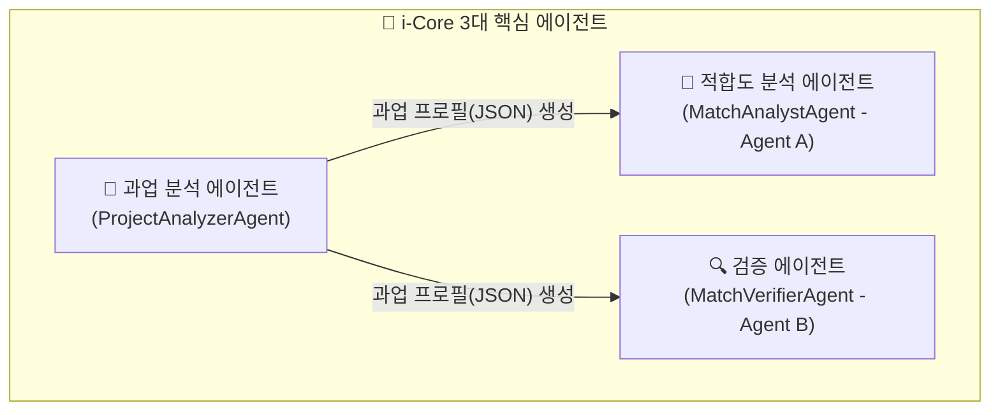
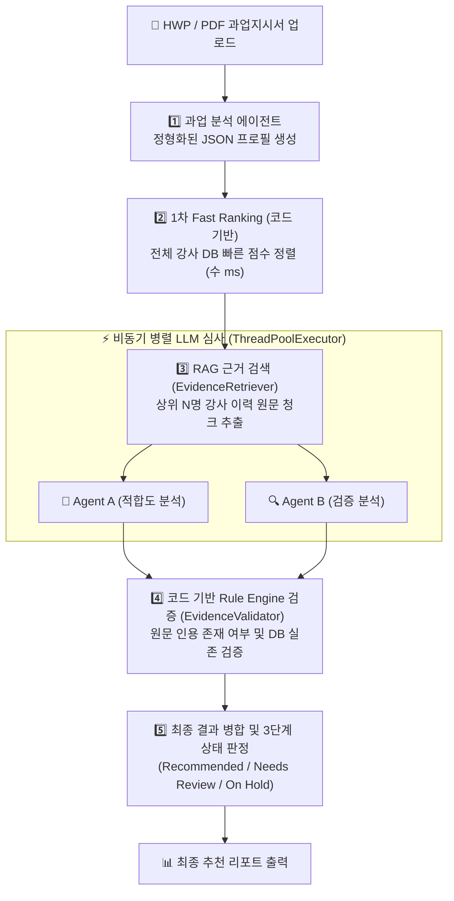
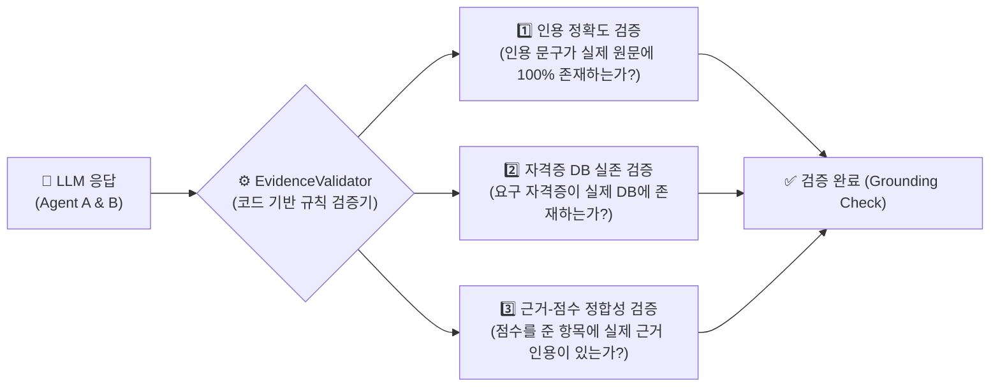

# 🤖 i-Core 에이전트 구조 및 동작 원리 쉬운 가이드

> **본 문서는 i-Core 강사 매칭 플랫폼의 인공지능(AI) 에이전트 아키텍처를 개발자뿐만 아니라 누구나 쉽게 이해할 수 있도록 구조, 역할, 데이터 흐름, 안전 검증 장치까지 상세히 설명한 가이드입니다.**

---

## 📌 목차 (Table of Contents)

1. [에이전트 시스템 개요](#1-에이전트-시스템-개요)
2. [핵심 3대 AI 에이전트 역할](#2-핵심-3대-ai-에이전트-역할)
3. [전체 매칭 워크플로우 (단계별 흐름)](#3-전체-매칭-워크플로우-단계별-흐름)
4. [하이브리드 검증 시스템 (LLM + Rule Engine)](#4-하이브리드-검증-시스템-llm--rule-engine)
5. [최종 3단계 판정 정책](#5-최종-3단계-판정-정책)
6. [백엔드 코드 구조 및 파일 매핑](#6-백엔드-코드-구조 및-파일-매핑)
7. [주요 기술적 특징 및 안전장치](#7-주요-기술적-특징-및-안전장치)

---

## 1. 에이전트 시스템 개요

### 💡 왜 단순 LLM이 아니라 "에이전트 구조"인가요?
단순히 ChatGPT나 Gemini에게 *"이 교육 과업지시서 보고 이 강사가 적합한지 알려줘"* 라고 물어보면 다음과 같은 문제가 발생할 수 있습니다:
* **환각(Hallucination)**: 강사 이력서에 없는 자격증이나 경력을 마치 있는 것처럼 거짓으로 지어냄.
* **주관성 및 불확실성**: 요청할 때마다 점수나 평가 기준이 달라짐.
* **느린 처리 속도**: 강사 DB에 있는 수십~수백 명을 한 명씩 LLM으로 확인하면 몇 십 분이 소요됨.

**i-Core 에이전트 시스템**은 이러한 문제를 해결하기 위해 **[역할 분담 에이전트 + RAG(검색 증강 생성) + 코드 기반 규칙 엔진(Rule Engine)]**을 조합하여 **초고속·고정밀·검증 가능**한 매칭 서비스를 제공합니다.

---

## 2. 핵심 3대 AI 에이전트 역할

i-Core의 AI 에이전트 시스템은 전문화된 3개의 에이전트가 역할을 나누어 협업합니다.



### 1) 📄 과업 분석 에이전트 (`ProjectAnalyzerAgent`)
* **역할**: 사용자가 업로드한 과업지시서(HWP, PDF 문서)를 읽고 분석합니다.
* **하는 일**:
  * 복잡한 문서 텍스트에서 **필수 자격요건(`qualifications`)**과 **평가기준(`evaluation_criteria`)**을 정형화된 JSON 프로필로 추출합니다.
  * 예: "Python 5년 이상, AI 관련 강의 경력 필수, 정보처리기사 우대"

### 2) 🎯 적합도 분석 에이전트 (`MatchAnalystAgent` / Agent A)
* **역할**: 특정 강사가 해당 과업에 얼마나 적합한지 긍정적/적합성 관점에서 심층 평가합니다.
* **하는 일**:
  * 5가지 항목(주제 일치도, 강의 깊이, 수강생 맞춤성, 경력/자격증, 근거 충실도)에 대해 점수를 부여합니다.
  * 반드시 RAG 검색 원문에서 **직접 문구(Verbatim Citation)**를 인용하여 평가 근거를 작성합니다.

### 3) 🔍 검증 에이전트 (`MatchVerifierAgent` / Agent B)
* **역할**: Agent A와 독립적으로 동일한 과업과 강사 데이터를 검토하여 리스크와 미흡한 점을 찾아냅니다.
* **하는 일**:
  * 교차 검증을 통해 자격요건 미달 항목, 경력 단절, 과장된 이력 여부를 꼼꼼하게 검토합니다.
  * Agent A의 편향을 방지하는 **안전 검토자(Auditor)** 역할을 수행합니다.

---

## 3. 전체 매칭 워크플로우 (단계별 흐름)

과업지시서가 입력된 순간부터 최종 강사 추천 결과가 나오기까지의 전체 흐름입니다.



### 단계별 상세 설명

1. **Step 1: 과업 문서 추출 및 프로필 정형화**
   * HWP/PDF 파일에서 텍스트를 추출하고 `ProjectAnalyzerAgent`가 체계적인 구조체(`ProjectProfile`)로 변환합니다.
2. **Step 2: 1차 Fast Ranking (코드 기반 초고속 정렬)**
   * LLM을 사용하지 않고 pure Python 코드로 기술 태그, 강의 경력, 실무 경력, 자격증 매칭 점수를 계산하여 전체 강사 중 상위 후보(Top K, 기본 5명)를 몇 밀리초(ms) 만에 추출합니다.
3. **Step 3: RAG 검색 (근거 데이터 수집)**
   * 상위 강사 후보들의 상세 이력서 원문과 과업 문서에서 핵심 연관 문단(Chunk)을 `EvidenceRetriever`가 자동으로 수집합니다.
4. **Step 4: 비동기 병렬 심사 (Agent A + Agent B)**
   * `ThreadPoolExecutor`를 통해 Agent A와 Agent B가 동시에 실행되어 시간을 절반 이하로 단축합니다.
5. **Step 5 & 6: 규칙 검증 및 최종 결과 출력**
   * AI의 인용문이 진짜 원문에 존재하는지 기계적으로 재검증 후 3가지 상태로 판정합니다.

---

## 4. 하이브리드 검증 시스템 (LLM + Rule Engine)

AI의 응답을 100% 그대로 믿지 않고, **코드 기반 규칙 엔진(EvidenceValidator)**이 0.1초 이내에 3중으로 검증합니다.



> 💡 **왜 필요한가요?**
> LLM이 "이 강사는 정보처리기사가 있습니다"라고 90점을 주었더라도, 실제 강사 DB 원문에 정보처리기사가 없다면 Rule Engine이 이를 즉시 적발하여 점수를 무효화하고 보류(`on_hold`) 처리합니다.

---

## 5. 최종 3단계 판정 정책

분석 결과는 인간 담당자가 직관적으로 판단할 수 있도록 **3가지 최종 상태**로 분류됩니다.

| 최종 상태 | 표시 | 판정 조건 및 의미 |
| :--- | :---: | :--- |
| **`recommended`**<br>(추천) | 🟢 | - Rule Engine 검증 **100% PASS**<br>- 근거 충실도 70% 이상<br>- 최종 점수 **80점 이상**<br>👉 **바로 강사로 채용/매칭 가능한 최우수 후보** |
| **`needs_review`**<br>(검토 필요) | 🟡 | - 필수 조건은 충족했으나 모호한 항목 존재<br>- 근거 충실도 70% 미만 또는 최종 점수 **60점 ~ 79점**<br>👉 **담당자가 이력서를 한 번 더 확인해야 하는 후보** |
| **`on_hold`**<br>(보류) | 🔴 | - 필수 자격 조건 미충족<br>- DB 내 자격증 미보유 또는 LLM 환각 인용 적발<br>- 최종 점수 **60점 미만**<br>👉 **해당 과업 조건에 부합하지 않는 후보** |

---

## 6. 백엔드 코드 구조 및 파일 매핑

i-Core의 에이전트 관련 백엔드 코드는 `backend/agent_core/` 디렉토리에 모여 있습니다.

```text
backend/agent_core/
├── schemas.py                 # 에이전트 간 주고받는 데이터 입출력 규격 (Pydantic Schema)
├── match_analyst.md           # Agent A 프롬프트 지침서
├── match_verifier.md          # Agent B 프롬프트 지침서
├── project_analyzer.md        # 과업 분석 에이전트 프롬프트 지침서
└── services/
    ├── agents.py              # ProjectAnalyzer, MatchAnalyst, MatchVerifier 클래스 구현
    ├── matching.py            # Agent A와 B의 결과를 하나로 병합하는 로직
    ├── candidate_ranker.py    # 1차 초고속 후보 정렬 (Pure Python Rule 기반)
    ├── evidence_retriever.py   # RAG 검색 (과업 문서 & 강사 원문 근거 수집)
    ├── evidence_validator.py   # 코드 기반 환각 및 자격증 검증기 (Rule Engine)
    ├── batch_matching.py      # 비동기 병렬 배치 매칭 워크플로우 관리
    └── llm.py                 # Gemini LLM 호출 및 JSON 파싱 어댑터
```

---

## 7. 주요 기술적 특징 및 안전장치

1. **독립적 교차 검증 (Independent Cross-Verification)**
   * Agent A와 Agent B는 서로의 결과를 모르는 상태에서 각각 심사합니다. 따라서 한쪽의 편향이나 실수가 다른 쪽에 영향을 주지 않습니다.
2. **동시성 및 Rate Limit 제어 (`asyncio` / `ThreadPoolExecutor`)**
   * 여러 후보 강사를 동시에 심사할 때 구글 Gemini API의 호출 제한(Rate Limit)을 넘지 않도록 동시 호출 수를 제어하면서 빠른 속도를 유지합니다.
3. **완전한 추적 가능성 (Traceability & Audit Log)**
   * 모든 매칭 실행 내역은 데이터베이스에 `run_id` 단위로 기록되어, 왜 특정 강사가 추천되었는지 인용 원문과 함께 언제든 복기할 수 있습니다.

---

### 📄 관련 다른 문서
* [Google Cloud Run 배포 가이드](file:///c:/Users/master/Documents/02-workspace/i-core/docs/gcp-deployment-guide.md)
* [에이전트 아키텍처 v2 사양서](file:///c:/Users/master/Documents/02-workspace/i-core/docs/agent-architecture-v2.md)
