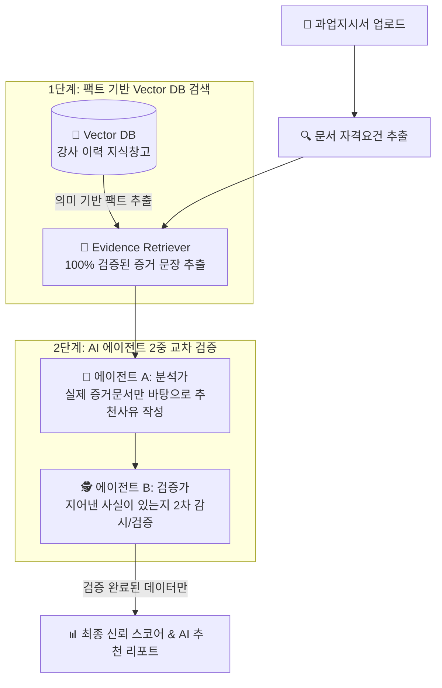

# 📖 i-Core 마스터 통합 가이드 (개념 비유부터 기술 명세 & GCP 실전 배포까지)

> **본 문서는 아래 3개 문서의 모든 내용을 단 하나로 완벽히 집대성한 최종 마스터 가이드입니다.**
> 1. 🎈 **웹·클라우드 기초 입문 가이드** (`easy-cs-and-cloud-guide.md` - 식당 비유, 도커 밀키트, Cloud Run 팝업 주방 등)
> 2. 🏗️ **시스템 아키텍처 명세서** (`system-architecture.md` - 전체 아키텍처 다이어그램, 5개 레이어 명세, 데이터 시퀀스)
> 3. 🚀 **GCP Cloud Run 배포 가이드** (`gcp-cloud-run-deployment-guide.md` - 1~5단계 실전 배포, 트러블슈팅, CI/CD)

---

## 📌 목차 (Table of Contents)

1. [📌 서비스 한눈에 보기 (Service Overview)](#1-서비스-한눈에-보기-service-overview)
2. [🛠️ 기술 스택 (Tech Stack Badges)](#2-기술-스택-tech-stack-badges)
3. [🎈 누구나 알아보기 쉬운 핵심 개념 5가지 (쉽게 이해하는 비유)](#3-누구나-알아보기-쉬운-핵심-개념-5가지-쉽게-이해하는-비유)
4. [🛡️ AI 할루시네이션 방지 구조 (Vector DB + RAG)](#4-ai-할루시네이션-방지-구조-vector-db--rag)
5. [🏗️ 전체 시스템 아키텍처 명세 & 데이터 흐름 (Mermaid)](#5-전체-시스템-아키텍처-명세--데이터-흐름-mermaid)
   - [5.1 전체 아키텍처 다이어그램](#51-전체-아키텍처-다이어그램)
   - [5.2 5개 레이어별 상세 구조](#52-5개-레이어별-상세-구조)
   - [5.3 데이터 흐름 시퀀스 다이어그램 (Sequence Diagram)](#53-데이터-흐름-시퀀스-다이어그램-sequence-diagram)
6. [🚀 구글 클라우드(GCP Cloud Run) 실전 배포 5단계](#6-구글-클라우드gcp-cloud-run-실전-배포-5단계)
   - [6.1 백엔드(FastAPI) 도커화 및 Cloud Run 배포 (IAM 권한 트러블슈팅)](#61-백엔드fastapi-도커화-및-cloud-run-배포-iam-권한-트러블슈팅)
   - [6.2 프론트엔드(React) Nginx 멀티 스테이지 도커화 & 배포](#62-프론트엔드react-nginx-멀티-스테이지-도커화--배포)
   - [6.3 구글 로그인 400 origin_mismatch & CORS 트러블슈팅](#63-구글-로그인-400-origin_mismatch--cors-트러블슈팅)
   - [6.4 GitHub Actions 자동 배포 (CI/CD Workflow)](#64-github-actions-자동-배포-cicd-workflow)
7. [💻 로컬 개발 테스트 vs 클라우드 운영 환경 구분법](#7-로컬-개발-테스트-vs-클라우드-운영-환경-구분법)

---

## 1. 📌 서비스 한눈에 보기 (Service Overview)

💡 **"수십 페이지 공고 문서, 매번 일일이 읽고 강사 찾기 힘들지 않으셨나요?"**

**i-Core**는 공공기관(나라장터 등)이나 기업에서 발주하는 사업 공고문(과업지시서)을 사람이 다 읽을 필요 없이, **AI가 문서를 분석하여 조건에 딱 맞는 최고의 강사를 순식간에 추천해주는 스마트 강사 매칭 서비스**입니다.

- ⏱️ **업무 시간 90% 단축**: 수시간씩 걸리던 서류 검토 및 강사 수소문을 **단 수초~수분**으로 단축.
- 🎯 **정확한 맞춤 추천**: 자격증, 강의 경력, 교육 분야를 종합 판단하여 추천 순위와 상세 이유 제공.
- 📅 **일정 충돌 방지**: 추천받은 강사의 기존 강의 스케줄 충돌 여부를 사전에 자동 점검.

---

## 2. 🛠️ 기술 스택 (Tech Stack Badges)

### 🎨 Frontend
<p>
  
  
  
  
  
  
  
</p>

### ⚙️ Backend & AI Core
<p>
  
  
  
  
  
  
  
</p>

### ☁️ Cloud Infrastructure & DevOps
<p>
  
  
  
  
  
</p>

---

## 3. 🎈 누구나 알아보기 쉬운 핵심 개념 5가지 (쉽게 이해하는 비유)

```text
  [ 🍷 식당 홀 (프론트엔드: React) ] ➔ 사용자가 보는 예쁜 화면
  [ 👨‍🍳 주방 (백엔드: FastAPI) ]      ➔ 데이터 조리 및 파싱 실행
  [ 🧊 냉장고 (데이터베이스: SQLite) ] ➔ 강사 이력 및 계정 데이터 보관
```

1. **🍷 프론트엔드 vs 👨‍🍳 백엔드 (식당 비유)**:
   - **프론트엔드(React)**: 손님이 보고 클릭하는 식당 홀과 메뉴판.
   - **백엔드(FastAPI)**: 손님의 주문(클릭)을 받아 요리(데이터 처리)를 진행하는 주방.
   - **데이터베이스(SQLite)**: 강사 데이터가 안전하게 보관된 냉장고.
2. **🍱 도커(Docker) = "밀키트(Meal Kit)"**:
   - 소스코드와 필요한 재료를 상자 하나에 포장하여 내 컴퓨터든 구글 서버든 **고장 없이 똑같이 구동**되게 만드는 포장 기술.
3. **☁️ 구글 클라우드 런(Cloud Run) = "팝업 주방 (Scale-to-Zero)"**:
   - 24시간 월세를 내는 대신, **손님이 접속할 때만 켜져서 요리하고 손님이 없으면 불이 꺼져 비용이 0원**이 되는 서버리스 서비스.
4. **📖 RAG & Vector DB = "오픈북 테스트"**:
   - AI에게 암기로 대답하지 말고, 우리가 나눠준 **진짜 강사 이력서 교재(Vector DB)만 펼쳐놓고 대답**하게 만드는 거짓말 차단 기술.
5. **🤖 GitHub Actions (CI/CD) = "자동 배달 로봇"**:
   - 개발자가 코드를 수정해 올리면 로봇이 알아서 구글 클라우드로 새 버전을 자동 배달/교체해 주는 시스템.

---

## 4. 🛡️ AI 할루시네이션(거짓말) 방지 구조 (Vector DB + RAG)

> *"AI가 존재하지 않는 강사의 경력을 지어내서 추천하지 않나요?"*

i-Core는 **Vector DB 기반 오픈북 테스트(RAG)**와 **2단계 AI 교차 검증 시스템**으로 거짓말을 철저히 차단합니다.



- **💾 1단계: Vector DB (팩트 전용 지식창고)**: 오직 검증된 강사의 실제 이력서만 의미 데이터(Vector)로 변환해 참조.
- **📑 2단계: Evidence Retriever (증거 돋보기)**: AI가 글을 쓰기 전 100% 사실로 확인된 증거 문장만 핀셋 선별.
- **🕵️ 3단계: 2-Step 교차 검증 (Analyst & Verifier)**: 분석가 AI가 추천글을 쓰면 검증가 AI가 옆에서 지어낸 말이 있는지 2차 감시.

---

## 5. 🏗️ 전체 시스템 아키텍처 명세 & 데이터 흐름 (Mermaid)

### 5.1 전체 아키텍처 다이어그램

```mermaid
graph TB
    subgraph Client_Layer ["🌐 클라이언트 계층 (Client)"]
        UserBrowser["💻 웹 브라우저 (User Browser)\nhttps://i-core-frontend-...run.app"]
    end

    subgraph Frontend_Container ["🎨 프론트엔드 컨테이너 (Cloud Run: i-core-frontend)"]
        NginxServer["⚡ Nginx Alpine Web Server (Port 8080)"]
        ReactApp["⚛️ React 19 + TypeScript SPA\n(Zustand / TanStack Query / Axios)"]
        NginxServer --> ReactApp
    end

    subgraph Backend_Container ["⚙️ 백엔드 컨테이너 (Cloud Run: i-core-backend)"]
        UvicornApp["🐍 FastAPI App (Uvicorn Async / Port 8080)"]
        
        subgraph Routers ["API Routers (/api)"]
            AuthRouter["🔒 /api/auth (OAuth/JWT)"]
            TaskRouter["📄 /api/task-orders (문서 파싱)"]
            MatchingRouter["🎯 /api/matching (AI 매칭)"]
            InstructorRouter["📊 /api/instructors (강사 DB)"]
        end

        subgraph Engines ["핵심 엔진 (Core Engines)"]
            MatchingCore["⚙️ matching_core\n(HWP/PDF/DOCX 파서 + Rule Scorer)"]
            AgentCore["🤖 agent_core\n(Gemini LLM + Vector DB RAG)"]
        end

        subgraph Database ["데이터베이스 (Database)"]
            AppDB[("💾 app.db\n(SQLite + SQLAlchemy Async)")]
            InstructorDB[("💾 내부_강사_정보.db\n(강사 프로필 DB)")]
            VectorDB[("💾 rag.sqlite3\n(Vector Store / Gemini Embeddings)")]
        end

        UvicornApp --> Routers
        Routers --> Engines
        Engines --> Database
    end

    subgraph External_Services ["☁️ 외부 클라우드 서비스 (External APIs)"]
        GoogleOAuth["🔑 Google OAuth 2.0 (GIS)"]
        GeminiAPI["🧠 Google Gemini 3.5 LLM API"]
    end

    UserBrowser -->|HTTPS 접속| NginxServer
    ReactApp -->|REST API (JSON / JWT)| UvicornApp
    ReactApp -->|1초 GIS 로그인| GoogleOAuth
    AuthRouter -->|ID Token 검증| GoogleOAuth
    AgentCore -->|RAG 추론 & 2-Step 검증| GeminiAPI
```

### 5.2 5개 레이어별 상세 구조
1. **프론트엔드**: React 19, TypeScript, Zustand(세션 관리), Axios 인터셉터(JWT 자동 부착), Nginx SPA 라우팅 지원.
2. **백엔드 API**: FastAPI, Uvicorn, 비동기 생명주기(`lifespan`) 마이그레이션, 보안 헤더 및 CORS 미들웨어.
3. **문서 파서 & 매칭 엔진 (`matching_core`)**: `pdfplumber`(PDF), `python-docx`(DOCX), `olefile`(HWP 바이너리 텍스트 복원) 및 규칙 스코어러.
4. **AI 에이전트 RAG (`agent_core`)**: Vector DB 지식창고 + Fact Evidence Retriever + Analyst/Verifier 2단계 에이전트 파이프라인.
5. **GCP 서버리스 인프라**: GCP Cloud Run (Scale-to-Zero) + Artifact Registry + GitHub Actions CI/CD.

### 5.3 데이터 흐름 시퀀스 다이어그램 (Sequence Diagram)

```text
[사용자]                 [프론트엔드]               [백엔드 API]              [matching_core]             [agent_core / LLM]
   │                         │                          │                           │                            │
   │ ──1. 과업지시서 업로드 ──>│                          │                           │                            │
   │                         │ ──2. POST /task-orders ──>│                           │                            │
   │                         │                          │ ──3. 문서 파일 전달 ────>│                            │
   │                         │                          │                           │ ──4. HWP/PDF 파싱 ──────>│
   │                         │                          │                           │ <── 5. 자격요건/과목 추출 ─│
   │                         │ <── 6. 파싱 결과 반환 ─────│                           │                            │
   │                         │                          │                           │                            │
   │ ──7. 강사 매칭 요청 ────>│                          │                           │                            │
   │                         │ ──8. POST /matching ────>│                           │                            │
   │                         │                          │ ──9. 1차 규칙 스코어링 ─>│                            │
   │                         │                          │ <── 10. 상위 후보군 반환 ─│                            │
   │                         │                          │                           │                            │
   │                         │                          │ ──11. 2차 RAG & AI 검증 ─────────────────────────────>│
   │                         │                          │                                                        │ ──12. Vector DB 팩트 추출
   │                         │                          │                                                        │ ──13. Gemini A/B 교차 검증
   │                         │ <── 14. 최종 리포트 반환 ─│ <── 15. 심층 평가 리포트 반환 ────────────────────────│
   │                         │                          │                           │                            │
```

---

## 6. 🚀 구글 클라우드(GCP Cloud Run) 실전 배포 5단계

### 6.1 백엔드(FastAPI) 도커화 및 Cloud Run 배포 (IAM 권한 트러블슈팅)
`backend/Dockerfile`:
```dockerfile
FROM python:3.11-slim
ENV PYTHONUNBUFFERED=1
WORKDIR /app
RUN apt-get update && apt-get install -y --no-install-recommends build-essential && rm -rf /var/lib/apt-get/lists/*
COPY requirements.txt .
RUN pip install --no-cache-dir -r requirements.txt
COPY . .
ENV PORT=8080
CMD ["sh", "-c", "uvicorn app.main:app --host 0.0.0.0 --port ${PORT:-8080}"]
```

**IAM 권한 트러블슈팅**: 최초 배포 시 저장소 이미지 읽기 권한이 없어 `Container import failed` 발생. 아래 명령어 적용:
```powershell
gcloud projects add-iam-policy-binding iceu-bangjeongho833 `
  --member="serviceAccount:761086712825-compute@developer.gserviceaccount.com" `
  --role="roles/artifactregistry.reader"
```

### 6.2 프론트엔드(React) Nginx 멀티 스테이지 도커화 & 배포
`frontend/Dockerfile`:
```dockerfile
FROM node:20-alpine AS builder
WORKDIR /app
COPY package*.json ./
RUN npm ci
COPY . .
RUN npm run build

FROM nginx:alpine
COPY --from=builder /app/dist /usr/share/nginx/html
COPY nginx.conf /etc/nginx/conf.d/default.conf
EXPOSE 8080
CMD ["nginx", "-g", "daemon off;"]
```

### 6.3 구글 로그인 400 origin_mismatch & CORS 트러블슈팅
1. **Google Cloud Console OAuth**: [사용자 인증 정보](https://console.cloud.google.com/apis/credentials?project=iceu-bangjeongho833) ➔ **승인된 자바스크립트 출처**에 `https://i-core-frontend-761086712825.asia-northeast3.run.app` 등록.
2. **CORS 허용**: `backend/app/core/config.py`의 `CORS_ORIGINS`에 프론트엔드 클라우드 URL 허용 등록.

### 6.4 GitHub Actions 자동 배포 (CI/CD Workflow)
`.github/workflows/deploy.yml`:
```yaml
name: Deploy i-Core to Google Cloud Run

on:
  push:
    branches:
      - main

jobs:
  deploy-backend:
    name: Deploy Backend
    runs-on: ubuntu-latest
    steps:
      - uses: actions/checkout@v4
      - uses: google-github-actions/auth@v2
        with:
          credentials_json: ${{ secrets.GCP_SA_KEY }}
      - uses: google-github-actions/setup-gcloud@v2
      - run: |
          gcloud run deploy i-core-backend \
            --source ./backend \
            --region asia-northeast3 \
            --allow-unauthenticated

  deploy-frontend:
    name: Deploy Frontend
    runs-on: ubuntu-latest
    steps:
      - uses: actions/checkout@v4
      - uses: google-github-actions/auth@v2
        with:
          credentials_json: ${{ secrets.GCP_SA_KEY }}
      - uses: google-github-actions/setup-gcloud@v2
      - run: |
          gcloud run deploy i-core-frontend \
            --source ./frontend \
            --region asia-northeast3 \
            --allow-unauthenticated
```
- GitHub 저장소 **Settings** ➔ **Secrets and variables** ➔ **Actions** ➔ `GCP_SA_KEY` 생성 및 JSON 비밀키 등록.

---

## 7. 💻 로컬 개발 테스트 vs 클라우드 운영 환경 구분법

| 구 분 | 🌐 클라우드 운영 환경 | 💻 로컬 개발/테스트 환경 |
| :--- | :--- | :--- |
| **접속 주소** | `https://i-core-frontend-761086712825.asia-northeast3.run.app` | `http://localhost:8900` |
| **실행 방법** | 24시간 브라우저 접속 | VS Code 터미널에서 `.\start.bat` 실행 |
| **환경 설정** | `.env.production` 자동 적용 | `.env.development` 자동 적용 |
| **코드 반영** | `git push origin main` 실행 시 자동 반영 | 코드 저장(`Ctrl+S`) 시 화면 즉시 반영 |

---

🎉 **본 통합 마스터 가이드는 i-Core 플랫폼의 입문 개념부터 실전 GCP 서버리스 운영까지 모든 내용을 완벽히 커버합니다.**
