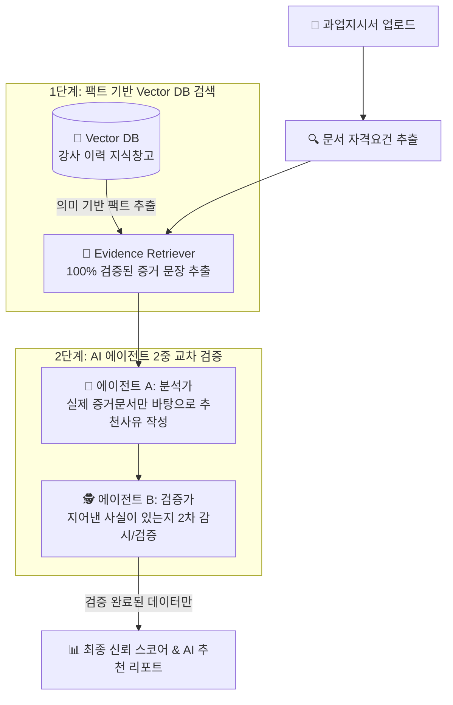

# 📖 i-Core 마스터 통합 가이드 (쉬운 개념 설명부터 GCP 클라우드 배포까지)

> **본 문서는 i-Core 강사 매칭 플랫폼의 서비스 개요, 핵심 시스템 아키텍처, 비전공자 맞춤 용어 해설, 그리고 구글 클라우드(GCP Cloud Run) 배포 및 GitHub Actions CI/CD 구축 전 과정을 하나로 통합한 종합 마스터 가이드입니다.**

---

## 📌 목차 (Table of Contents)

1. [📌 서비스 한눈에 보기 (Service Overview)](#1-서비스-한눈에-보기-service-overview)
2. [🛠️ 기술 스택 (Tech Stack)](#2-기술-스택-tech-stack)
3. [🎈 비전공자 맞춤 핵심 개념 4가지 (쉬운 비유)](#3-비전공자-맞춤-핵심-개념-4가지-쉬운-비유)
4. [🛡️ AI 할루시네이션(거짓말) 방지 구조 (Vector DB + RAG)](#4-ai-할루시네이션거짓말-방지-구조-vector-db--rag)
5. [🏗️ 시스템 아키텍처 & 데이터 흐름 다이어그램](#5-시스템-아키텍처--데이터-흐름-다이어그램)
6. [🚀 구글 클라우드(GCP Cloud Run) 배포 5단계](#6-구글-클라우드gcp-cloud-run-배포-5단계)
7. [💻 로컬 개발 테스트 vs 클라우드 운영 환경 구분법](#7-로컬-개발-테스트-vs-클라우드-운영-환경-구분법)

---

## 1. 📌 서비스 한눈에 보기 (Service Overview)

💡 **"수십 페이지 공고 문서, 매번 일일이 읽고 강사 찾기 힘들지 않으셨나요?"**

**i-Core**는 공공기관(나라장터 등)이나 기업에서 발주하는 사업 공고문(과업지시서)을 사람이 다 읽을 필요 없이, **AI가 문서를 분석하여 조건에 딱 맞는 최고의 강사를 순식간에 추천해주는 스마트 강사 매칭 서비스**입니다.

- ⏱️ **업무 시간 90% 단축**: 수시간씩 걸리던 서류 검토 및 강사 수소문을 **단 수초~수분**으로 단축.
- 🎯 **정확한 맞춤 추천**: 자격증, 강의 경력, 교육 분야를 종합 판단하여 추천 순위와 상세 이유 제공.
- 📅 **일정 충돌 방지**: 추천받은 강사의 기존 강의 스케줄 충돌 여부를 사전에 자동 점검.

---

## 2. 🛠️ 기술 스택 (Tech Stack)

### 🎨 Frontend
<p>
  
  
  
  
  
  
</p>

### ⚙️ Backend & AI Core
<p>
  
  
  
  
  
  
</p>

### ☁️ Cloud Infrastructure & DevOps
<p>
  
  
  
  
  
</p>

---

## 3. 🎈 비전공자 맞춤 핵심 개념 4가지 (쉬운 비유)

```text
  [ 🍷 식당 홀 (프론트엔드: React) ] ➔ 사용자가 보는 예쁜 화면
  [ 👨‍🍳 주방 (백엔드: FastAPI) ]      ➔ 데이터 조리 및 파싱 실행
  [ 🧊 냉장고 (데이터베이스: SQLite) ] ➔ 강사 이력 및 계정 데이터 보관
```

1. **🍷 프론트엔드 vs 👨‍🍳 백엔드 (식당 비유)**:
   - **프론트엔드(React)**: 손님이 보고 클릭하는 식당 홀과 메뉴판.
   - **백엔드(FastAPI)**: 손님의 주문(클릭)을 받아 요리(데이터 처리)를 진행하는 주방.
2. **🍱 도커(Docker) = "밀키트(Meal Kit)"**:
   - 소스코드와 재료를 상자 하나에 포장하여 내 컴퓨터든 구글 서버든 **고장 없이 똑같이 구동**되게 만드는 포장 기술.
3. **☁️ 구글 클라우드 런(Cloud Run) = "팝업 주방 (Scale-to-Zero)"**:
   - 24시간 월세를 내는 대신, **손님이 접속할 때만 켜져서 요리하고 손님이 없으면 불이 꺼져 비용이 0원**이 되는 서버리스 서비스.
4. **🤖 GitHub Actions (CI/CD) = "자동 배달 로봇"**:
   - 개발자가 코드를 올려주면 로봇이 알아서 구글 클라우드로 새 버전을 자동 배달/교체해 주는 시스템.

---

## 4. 🛡️ AI 할루시네이션(거짓말) 방지 구조 (Vector DB + RAG)

> *"AI가 존재하지 않는 강사의 경력을 지어내서 추천하지 않나요?"*

i-Core는 **Vector DB 기반 오픈북 테스트(RAG)**와 **2단계 AI 교차 검증 시스템**으로 거짓말을 철저히 차단합니다.



- **💾 1단계: Vector DB (팩트 전용 지식창고)**: 오직 검증된 강사의 실제 이력서만 의미 데이터(Vector)로 변환해 참조.
- **📑 2단계: Evidence Retriever (증거 돋보기)**: AI가 글을 쓰기 전 100% 사실로 확인된 증거 문장만 핀셋 선별.
- **🕵️ 3단계: 2-Step 교차 검증 (Analyst & Verifier)**: 분석가 AI가 추천글을 쓰면 검증가 AI가 옆에서 지어낸 말이 있는지 2차 감시.

---

## 5. 🏗️ 시스템 아키텍처 & 데이터 흐름 다이어그램

```mermaid
graph TB
    subgraph Client_Layer ["🌐 클라이언트 계층"]
        UserBrowser["💻 웹 브라우저 (User Browser)\nhttps://i-core-frontend-...run.app"]
    end

    subgraph Frontend_Container ["🎨 프론트엔드 (Cloud Run: i-core-frontend)"]
        NginxServer["⚡ Nginx Alpine Web Server (Port 8080)"]
        ReactApp["⚛️ React 19 + TypeScript SPA"]
        NginxServer --> ReactApp
    end

    subgraph Backend_Container ["⚙️ 백엔드 (Cloud Run: i-core-backend)"]
        UvicornApp["🐍 FastAPI App (Port 8080)"]
        
        subgraph Engines ["핵심 엔진"]
            MatchingCore["⚙️ matching_core (파서 + Rule Scorer)"]
            AgentCore["🤖 agent_core (Gemini LLM + Vector DB)"]
        end

        UvicornApp --> Engines
    end

    UserBrowser -->|HTTPS 접속| NginxServer
    ReactApp -->|REST API (JSON/JWT)| UvicornApp
    AgentCore -->|RAG 추론| GeminiAPI["🧠 Google Gemini API"]
```

---

## 6. 🚀 구글 클라우드(GCP Cloud Run) 배포 5단계

### 1단계: 백엔드 도커화 및 Cloud Run 배포
- `backend/Dockerfile` 작성 및 `uvicorn` 포트(8080) 바인딩.
- Cloud Run 배포 후 IAM 권한(`roles/artifactregistry.reader`) 부여 완료.

### 2단계: 프론트엔드 Nginx 멀티 스테이지 배포
- `.env.development`(로컬)과 `.env.production`(운영 Cloud Run 주소) 분리.
- `frontend/Dockerfile` Nginx 기반 멀티 스테이지 빌드 및 배포 완료.

### 3단계: 구글 로그인(Google OAuth) 400 origin_mismatch 트러블슈팅
- Google Cloud Console ➔ **승인된 자바스크립트 출처**에 `https://i-core-frontend-761086712825.asia-northeast3.run.app` 등록.
- 백엔드 CORS 목록(`CORS_ORIGINS`)에 프론트엔드 클라우드 URL 허용 등록.

### 4단계: GitHub Actions 자동 배포 (CI/CD)
- `.github/workflows/deploy.yml` 작성.
- GitHub Secret `GCP_SA_KEY` 등록 완료 (`git push origin main` 시 자동 배포).

---

## 7. 💻 로컬 개발 테스트 vs 클라우드 운영 환경 구분법

| 구 분 | 🌐 클라우드 운영 환경 | 💻 로컬 개발/테스트 환경 |
| :--- | :--- | :--- |
| **접속 주소** | `https://i-core-frontend-761086712825.asia-northeast3.run.app` | `http://localhost:8900` |
| **실행 방법** | 언제나 웹 브라우저로 접속 | VS Code 터미널에서 `.\start.bat` 실행 |
| **백엔드 연동** | Cloud Run 백엔드 (`...run.app`) | 로컬 백엔드 (`http://127.0.0.1:8700`) |
| **코드 반영** | `git push origin main` 실행 시 자동 반영 | 코드 저장(`Ctrl+S`) 시 화면 즉시 반영 |

---

🎉 **이제 i-Core 서비스의 쉬운 개념부터 시스템 아키텍처, GCP 서버리스 배포까지 모든 내용이 완성되었습니다!**
