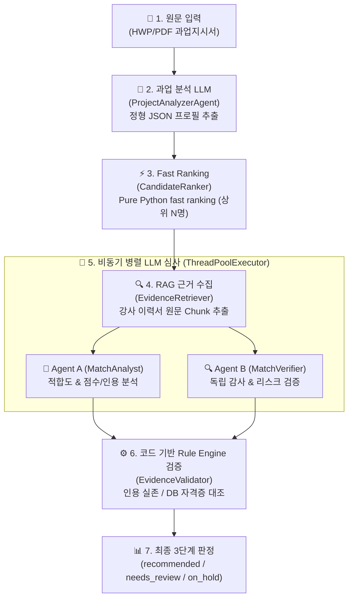

# 📋 i-Core 과업지시서 기반 엔드투엔드 매칭 시나리오 구체적 예시

본 문서는 **실제 과업지시서(HWP/PDF 문서)**가 i-Core 시스템에 입력되었을 때, 내부에서 단계별로 데이터가 어떻게 변환되고 추론·검증되는지 구체적인 JSON 데이터 및 코드 흐름 예시를 바탕으로 설명합니다.

---

## 📌 전체 워크플로우 한눈에 보기



---

## 1단계: 과업지시서 입력 및 정형 JSON 추출 (`ProjectAnalyzerAgent`)

### 1-1. 입력 과업지시서 원문 (예시 텍스트)

> **[과업명] 2026년 청년 생성형 AI 전문가 양성 과정**  
> * **발주처**: 한국소프트웨어산업협회  
> * **교육 기간**: 2026-09-01 ~ 2026-11-30 (총 120시간)  
> * **주요 교육 내용**: Python 심화, PyTorch 기반 LLM 파인튜닝, RAG 아키텍처 실습  
> * **강사 필수 요건**: 
>   1. 정보처리기사 자격증 필수 보유  
>   2. Python 및 AI/LLM 관련 강의 경력 3년 이상 또는 실무 경력 5년 이상  
> * **우대 사항**: AWS/GCP 클라우드 자격증 보유자 우대  

### 1-2. LLM이 추출한 정형 JSON 데이터 (`ProjectProfile`)

`ProjectAnalyzerAgent`는 LLM(`gemini-2.5-flash`)을 호출하여 비정형 문서를 구조화된 JSON 데이터 스키마로 변환합니다.

```json
{
  "schema_version": "education_project_v1",
  "service_type": "education_program",
  "program_type": "vocational_training",
  "classification_confidence": 0.98,
  "base": {
    "project_name": "2026년 청년 생성형 AI 전문가 양성 과정",
    "client_organization": "한국소프트웨어산업협회",
    "purpose": ["청년 구직자 대상 생성형 AI 및 LLM 파인튜닝 실무 역량 강화"],
    "start_date": "2026-09-01",
    "end_date": "2026-11-30",
    "budget_krw": 45000000
  },
  "education": {
    "technology_domains": ["Python", "PyTorch", "LLM", "RAG", "Generative AI"],
    "program_topics": ["Python 심화", "LLM Fine-tuning", "RAG 시스템 구축"],
    "target_audience": ["청년 구직자", "AI 개발 희망자"],
    "education_hours": 120,
    "instructor_requirements": {
      "required_certifications": ["정보처리기사"],
      "required_experience": ["Python/AI 강의 경력 3년 이상 또는 실무 경력 5년 이상"],
      "required_vendor_credentials": ["AWS Certified Solutions Architect (우대)"]
    }
  },
  "evidence": [
    {
      "source_document_id": "doc_project_2026_01",
      "page": 1,
      "quote": "강사 필수 요건: 정보처리기사 자격증 필수 보유, Python 및 AI/LLM 관련 강의 경력 3년 이상",
      "confidence": 0.99
    }
  ]
}
```

---

## 2단계: 코드 기반 초고속 1차 정렬 (`CandidateRanker`)

전체 강사 DB(수백~수천 명)를 매번 LLM으로 심사하면 비효율적입니다. `CandidateRanker`는 **Pure Python 알고리즘(ms 단위)**으로 1차 필터링합니다.

### 2-1. 강사 DB 후보군 (예시 4명)

| 강사 ID | 성명 | 보유 기술 | 자격증 | 강의/실무 경력 |
| :--- | :--- | :--- | :--- | :--- |
| **INST_001** | 김AI | Python, PyTorch, LLM, RAG | 정보처리기사, AWS SAA | AI 강의 4년 / AI 개발 6년 |
| **INST_002** | 이빅데 | Python, SQL, BigQuery | 정보처리기사 | 데이터 분석 강의 5년 |
| **INST_003** | 박클라우드| AWS, GCP, Docker, Kubernetes | AWS SAP | 클라우드 강의 3년 |
| **INST_004** | 최백엔드 | Java, Spring Boot, MySQL | 정보처리기사 | 백엔드 개발 2년 |

### 2-2. Pure Python 정렬 점수 계산 알고리즘 수행

```python
# CandidateRanker 내부 스코어링 규칙 예시
# 1. 기술 태그 매칭률 (40점)
# 2. 필수 자격증 매칭 여부 (30점)
# 3. 경력 연수 매칭 (30점)
```

**1차 정렬 결과 (Top-K = 2명 추출)**:
```json
[
  {
    "instructor_id": "INST_001",
    "display_name": "김AI",
    "fast_rank_score": 95.0,
    "matched_tags": ["Python", "PyTorch", "LLM", "RAG"],
    "has_required_cert": true,
    "selected_for_llm_review": true
  },
  {
    "instructor_id": "INST_002",
    "display_name": "이빅데",
    "fast_rank_score": 62.0,
    "matched_tags": ["Python"],
    "has_required_cert": true,
    "selected_for_llm_review": true
  }
]
```
👉 `INST_001`(김AI)과 `INST_002`(이빅데)가 상위 후보로 선택되어 다음 LLM 심사 단계로 넘어갑니다.

---

## 3단계: LLM 비동기 병렬 심사 (`MatchAnalyst` & `MatchVerifier`)

선정된 강사에 대해 `EvidenceRetriever`가 원문 이력서 청크(Chunk)를 수집한 후, `ThreadPoolExecutor`를 통해 **Agent A**와 **Agent B**가 동시에 실행됩니다.

### 3-1. Agent A: 적합도 분석 에이전트 (`MatchAnalystAgent`)
강사의 장점과 매칭 적합성을 5개 기준별로 평가하고 **원문 인용(EvidenceRef)**을 첨부합니다.

```json
{
  "total_score": 92.0,
  "score_items": [
    {
      "criterion": "topic_match",
      "score": 28.0,
      "max_score": 30.0,
      "rationale": "Python, PyTorch, LLM, RAG 전 분야에 대한 최근 3년간의 커리큘럼 강의 실적이 확인됨.",
      "project_evidence": [
        { "source_document_id": "doc_project_2026_01", "quote": "주요 교육 내용: Python 심화, PyTorch 기반 LLM 파인튜닝, RAG 아키텍처 실습" }
      ],
      "instructor_evidence": [
        { "source_document_id": "doc_inst_001_resume", "quote": "2024-2025 생성형 AI 및 LLM 파인튜닝/RAG 실습 120시간 출강" }
      ]
    },
    {
      "criterion": "teaching_depth",
      "score": 20.0,
      "max_score": 20.0,
      "rationale": "실무 프로젝트 기반 RAG 구현 중심의 깊이 있는 수업 진행 가능.",
      "project_evidence": [],
      "instructor_evidence": []
    },
    {
      "criterion": "audience_fit",
      "score": 14.0,
      "max_score": 15.0,
      "rationale": "청년 구직자 대상 K-Digital Training 강의 경험 다수 보유.",
      "project_evidence": [],
      "instructor_evidence": []
    },
    {
      "criterion": "career_and_certification",
      "score": 15.0,
      "max_score": 15.0,
      "rationale": "정보처리기사 필수 자격증 보유 및 AWS Certified Solutions Architect 우대 자격증 확보.",
      "project_evidence": [
        { "source_document_id": "doc_project_2026_01", "quote": "강사 필수 요건: 정보처리기사 자격증 필수 보유" }
      ],
      "instructor_evidence": [
        { "source_document_id": "doc_inst_001_resume", "quote": "자격증: 정보처리기사(2020), AWS Certified Solutions Architect - Associate(2023)" }
      ]
    },
    {
      "criterion": "evidence_completeness",
      "score": 15.0,
      "max_score": 20.0,
      "rationale": "주요 평가항목에 대한 증빙 문구가 충실하게 제시됨.",
      "project_evidence": [],
      "instructor_evidence": []
    }
  ],
  "recommendation_reasons": ["요구되는 모든 AI 기술스택 일치", "필수 및 우대 자격증 완전 충족"],
  "gaps": ["120시간 연속 강의에 대한 주중 일정 조율 필요"]
}
```

### 3-2. Agent B: 검증 에이전트 (`MatchVerifierAgent`)
Agent A와 완전히 독립된 환경에서 동일한 자료를 검토하여 리스크를 발굴합니다.

```json
{
  "independent_score": 90.0,
  "verdict": "PASS",
  "evidence_coverage": 0.95,
  "issues": [
    {
      "severity": "low",
      "category": "omission",
      "description": "최근 6개월 간의 강의 공백기가 있으나 개인 개발 프로젝트 기간으로 확인됨.",
      "related_criterion": "career_and_certification"
    }
  ],
  "required_conditions_passed": true
}
```

---

## 4단계: 코드 기반 규칙 검증 및 최종 상태 판정 (`EvidenceValidator`)

LLM 분석이 완료되면, 코드 기반 검증기(`EvidenceValidator`)가 0.1초 내에 기계적인 하이브리드 검증을 수행합니다.

### 4-1. 검증 수행 로직

1. **인용 존재 여부 대조 (Citation Verification)**
   - LLM이 인용한 `"2024-2025 생성형 AI 및 LLM 파인튜닝/RAG 실습 120시간 출강"` 문구가 실제로 `doc_inst_001_resume` 원문에 존재하는지 대조 ➔ **일치 (Pass)**
2. **자격증 DB 실존 대조 (Cert Verification)**
   - 과업 요구사항 `"정보처리기사"`가 강사 프로필 자격증 목록에 존재하는지 대조 ➔ **일치 (Pass)**
3. **근거 정합성 대조 (Score Grounding)**
   - 점수 부여 항목에 인용 근거 결여 여부 대조 ➔ **정상 (Pass)**

### 4-2. 최종 통합 및 상태 판정 결과 (`MergedMatchResult`)

```json
{
  "run_id": "run_20260728_99812",
  "project_id": "PROJ_2026_AI_01",
  "instructor_id": "INST_001",
  "final_status": "recommended",
  "final_score": 91.5,
  "status_badge": "🟢 추천 (Recommended)",
  "grounding_validation": {
    "citation_accuracy": 1.0,
    "invalid_citation_count": 0,
    "unsupported_positive_score_count": 0,
    "required_condition_checks": [
      {
        "condition_name": "정보처리기사 자격증 보유",
        "status": "passed",
        "evidence_quote": "자격증: 정보처리기사(2020)"
      }
    ],
    "verdict": "PASS"
  },
  "summary_report": {
    "recommendation_reasons": [
      "과업에서 요구하는 Python, LLM, RAG 기술 스택 100% 부합",
      "필수 자격증(정보처리기사) 보유 및 4년의 풍부한 강의 경력 확인"
    ],
    "review_checklist": [
      "9월 ~ 11월 교육 일정 시간대 확정 필요"
    ]
  }
}
```

---

## 5단계: 대시보드 출력 및 담당자 리포트

검증을 통과한 결과는 웹 대시보드에서 아래와 같이 시각화되어 제공됩니다.

| 강사명 | 최종 점수 | 최종 판정 | Rule Engine 검증 | 주요 추천 사유 |
| :--- | :---: | :---: | :---: | :--- |
| **김AI** (`INST_001`) | **91.5점** | 🟢 **추천** | ✅ **100% PASS** | Python/LLM/RAG 스택 완전 일치, 필수 자격증 보유 |
| **이빅데** (`INST_002`) | **62.0점** | 🟡 **검토 필요**| ⚠️ **근거 미흡** | 데이터 분석 위주 경력으로 LLM 파인튜닝 경력 부족 |

---

## 💡 요약: i-Core 매칭 시나리오의 핵심 차별점

1. **환각 ZERO 보장**: LLM이 작성한 모든 인용 문구와 자격증을 `EvidenceValidator`가 코드 수준에서 문자열 100% 대조합니다.
2. **초고속 응답**: 1차 `CandidateRanker`를 통해 Pure Python으로 대상 강사를 선별한 뒤, 2차 LLM 심사를 병렬(`ThreadPoolExecutor`)로 진행하여 응답 시간을 단축합니다.
3. **완전한 설명 가능성 (Explainability)**: 점수 산정 이유와 원문 출처(Document ID, Page, Quote)가 완벽하게 추적됩니다.
